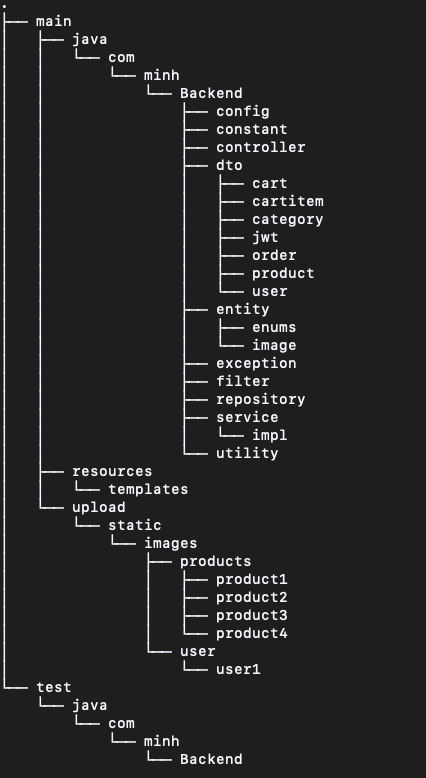
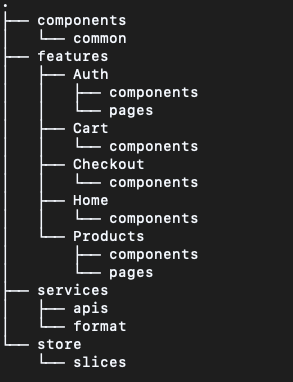
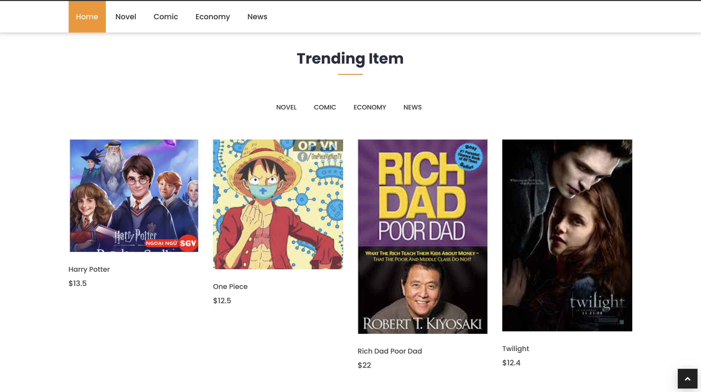
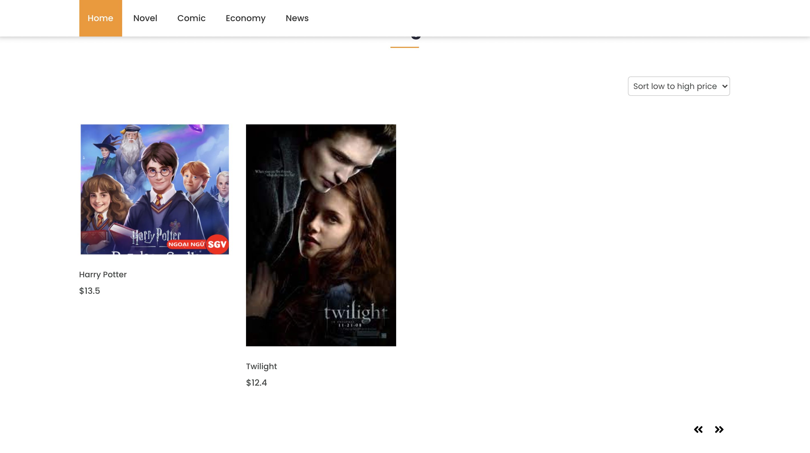
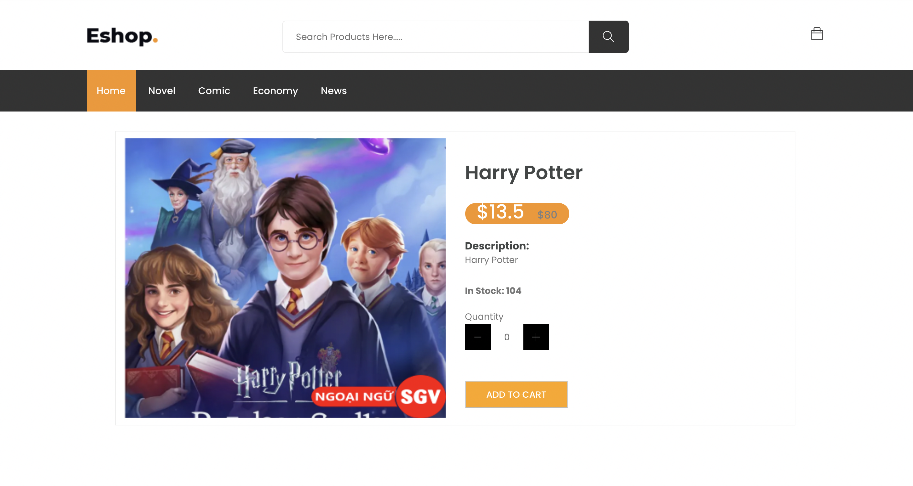
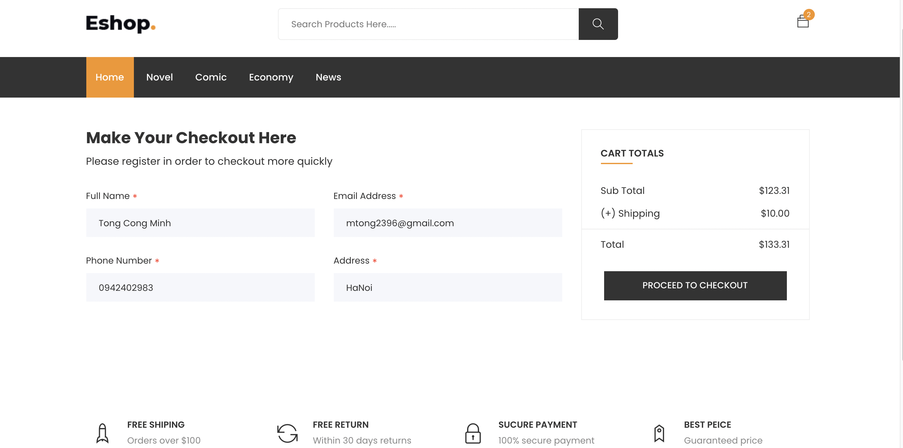
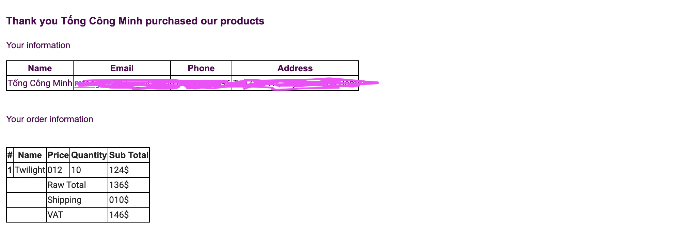

# Book Ecommerce Application

Ecommerce Website used sale books by entrepreneur

---
**Main Technology**:
1. Server:
  - SpringBoot
  - SpringSecurity
  - JPA, Hibernate
2. Database:
  - MySQL
3. Client:
  - Reactjs
  - Redux, ReduxToolkit

---

**Project Struture**
1. Backend:

2. Frontend:

---
**Some Images from App**
1. Screen Homepage:

2. Products List By Category:

3. Product:

4. Cart:

5. Checkout:

6. Login:

7. Register:

7. Email:

