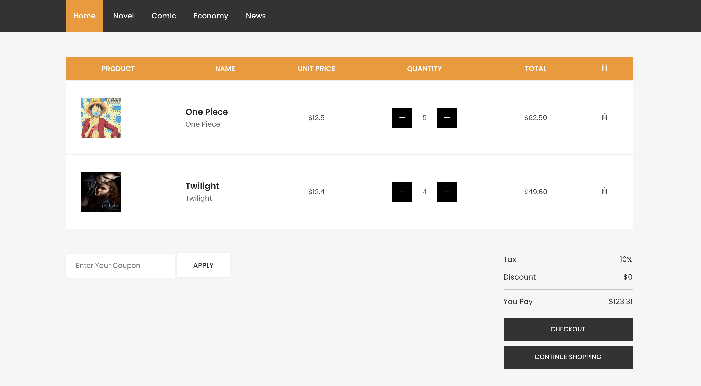
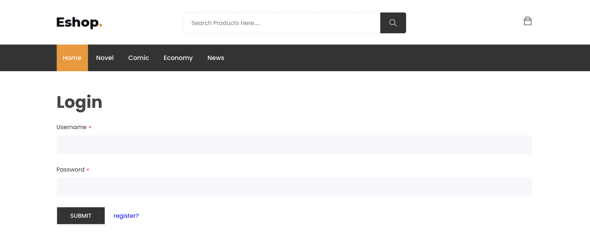
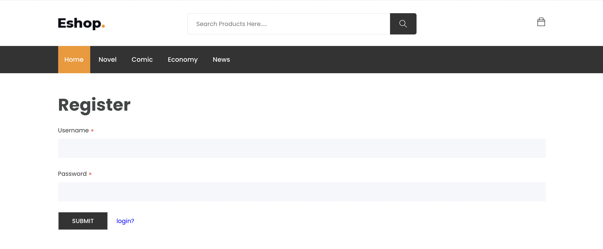

# Book Ecommerce Application

Ecommerce Website used sale books by entrepreneur

---
**Main Technology**:
1. Server:
  - SpringBoot
  - SpringSecurity
  - JPA, Hibernate
2. Database:
  - MySQL
3. Client:
  - Reactjs
  - Redux, ReduxToolkit

---

**Project Struture**
1. Backend:
.
├── main
│   ├── java
│   │   └── com
│   │       └── minh
│   │           └── Backend
│   │               ├── config
│   │               ├── constant
│   │               ├── controller
│   │               ├── dto
│   │               │   ├── cart
│   │               │   ├── cartitem
│   │               │   ├── category
│   │               │   ├── jwt
│   │               │   ├── order
│   │               │   ├── product
│   │               │   └── user
│   │               ├── entity
│   │               │   ├── enums
│   │               │   └── image
│   │               ├── exception
│   │               ├── filter
│   │               ├── repository
│   │               ├── service
│   │               │   └── impl
│   │               └── utility
│   ├── resources
│   │   └── templates
│   └── upload
│       └── static
│           └── images
│               ├── products
│               │   ├── product1
│               │   ├── product2
│               │   ├── product3
│               │   └── product4
│               └── user
│                   └── user1
└── test
    └── java
        └── com
            └── minh

2. Frontend:
.
├── components
│   └── common
├── features
│   ├── Auth
│   │   ├── components
│   │   └── pages
│   ├── Cart
│   │   └── components
│   ├── Checkout
│   │   └── components
│   ├── Home
│   │   └── components
│   └── Products
│       ├── components
│       └── pages
├── services
│   ├── apis
│   └── format
└── store
    └── slices

---
**Some Images from App**
1. Screen Homepage:

2. Products List By Category:

3. Product:

4. Cart:

5. Checkout:

6. Login:

7. Register:

7. Email:

